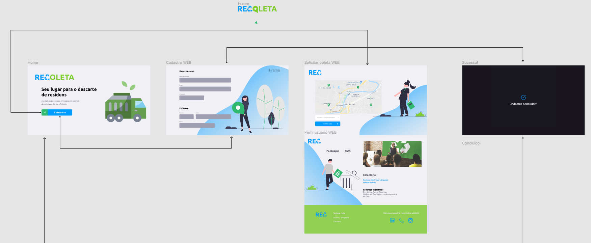
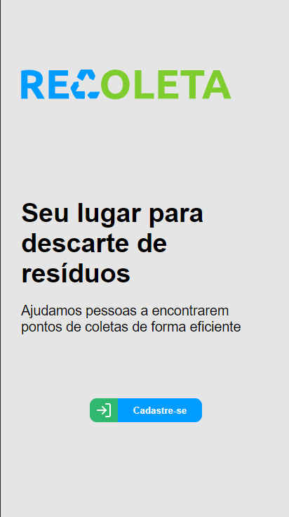
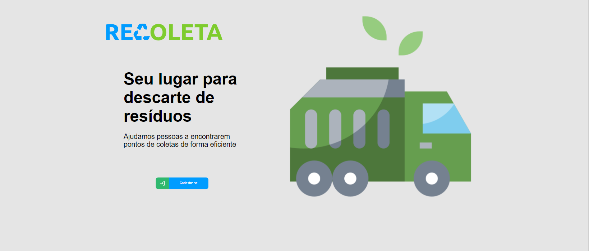
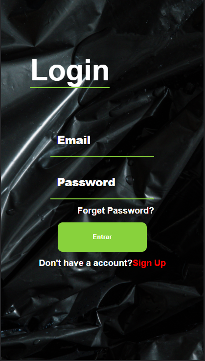
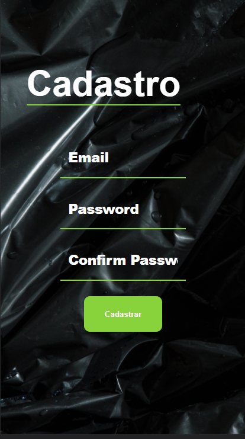
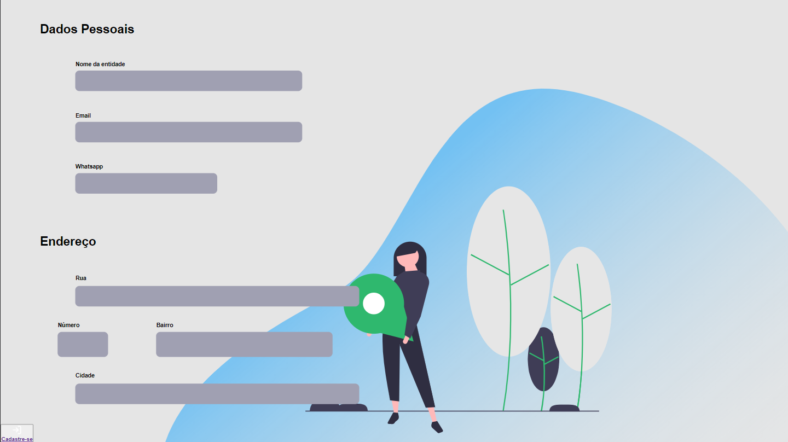

# Projeto de Engenharia de Software -> Readme Template

A discussão da problemática ainda está em andamento...

## 🚀 Começando

Passo a passo 

### 📋 Pré-requisitos X

```

```

### 🔧 Instalação

Passos para instalação de componentes

```

```

## 📦 Desenvolvimento

Notas do desenvolvimento

## 🛠️ Construído com

* [Exemplo](https://github.com/JeanGrijp/EngenhariaDeSoftwareProj/README.md) - Exemplo da estrutura

## ✒️ Colaboradores

* **Aslay Clevisson**
* **Izack Angelo**
* **Jean Grijp**
* **Marcson Santos** 

Lista dos [colaboradores](https://github.com/JeanGrijp/EngenhariaDeSoftwareProj/graphs/contributors) que participaram deste projeto.

<br>
<br>

# Descrição do Projeto
O trabalho será direcionado a um ambiente onde a coleta de resíduos recicláveis de várias regiões seja feita de uma forma mais fácil tanto para o órgão que coleta, quanto para quem se oferece a doar os resíduos recicláveis.

<br>
<br>

# Justificativa do Projeto


<br>
<br>

# Cenário
O cenário abordado pela equipe abrange quaisquer tipos de pessoas, basta estarem dispostas. Como será utilizado o meio figital para melhorar o cenário, acreditamos que pessoas mais jovens tenham certa facilidade para se adequar.


# Oportunidades
<div>
O cenário da pandemia está trazendo um novo normal para a nossa sociedade, esse novo normal consiste em ideias que tragam um meio mais acessível para as pessoas e um maior cuidado com a saúde e atenção com o meio ambiente. Apesar da nossa ideia abordar uma nova visão de qualidade de vida, a ausência de incentivos pode ser um dos maiores fatores que levam as pessoas a não participarem efetivamente da causa.
<br>
<br>
Visto o atual cenário, onde as pessoas, em grande parte, estão em casa e onde o país inteiro está em crise, a ideia de sustentabilidade começa a se aquecer cada vez mais. Observando isso, enxergamos a oportunidade de trazer um ambiente que ofereça o sustentável e o digital, caracterizando um ambiente de conforto de casa e segurança. Consequentemente, nosso resultado traz a facilidade, sustentabilidade e segurança.
</div>
<br>
<br>

# Personas
Miguel, um jovem de 28 anos que reside na cidade do Recife, e vive uma vida corrida, mensalmente, costuma reunir alguns materiais recicláveis, dentre esses materiais estão garrafas, papéis, componentes eletrônicos e etc. Miguel tem ideia do quão necessária a reciclagem é para a relação social e para o  meio ambiente, por isso, ele busca, quando possível, fazer o descarte desses materiais acumulados, em um lugar adequado para esse descarte. Porém, isso não pode ser feito com uma maior frequência por Miguel, comenta ele que gostaria que existissem pontos onde o descarte fosse mais fácil de acontecer, afinal, para ele, alguns pontos são distantes e levam tempo para chegar até esses locais, com isso, ele nem sempre se sente motivado o suficiente para fazer esse descarte de materiais recicláveis, acabando por descartar o lixo reciclável junto com o orgânico por ser uma forma mais fácil de descarte. 

<br>
<br>

# Validação
Realizamos uma pequena pesquisa com o Google Form, com a inteção de criar uma proto persona, onde 62 pessoas responderam nossa pesquisa, assim conseguimos montar um perfil da nossa persona e validar o problema. Além da pesquisa, com a intenção de validar o problema a ser resolvido, pesquisamos por dados no Google e notícias sobre o tema.

# Prototipagem

<div>
  
</div>
<br>
<br>

# Telas
<div>
  
</div>
<br>
<br>
<div>
  
</div>
<br>
<br>
<div>
  
</div>
<br>
<br>

<div>
  
</div>

<br>
<br>

<div>
  
</div>
<br>
<br>

<div>
  
</div>

# Desenvolvimento


# Melhorias Futuras


# Tech Stack

### Backend

- Firebase

### Frontend

- React.js

# Libs usadas


### Backend

- Firebase

### Frontend

- styled-components
- axios
- ESLint

# Rodando o projeto localmente

bash
git clone 
cd projeto


## Backend

Firebase script no arquivo firebase.js do front-end.


## Frontend

bash

cd .\frontendd\

yarn start


# Final Considerations


